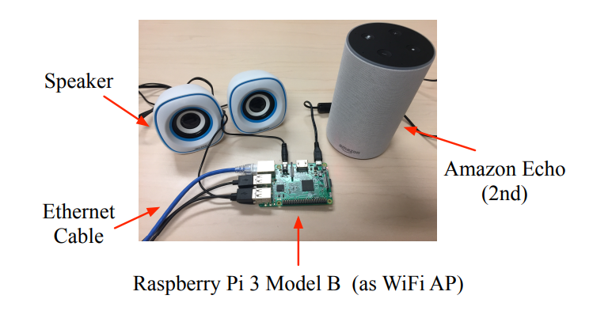

# DeepVCFingerprinting

This repository contains the source code and data for the Voice Command Fingerprinting Attack using Deep Learning.  The attack is a privacy leakage attack that allows a passive adversary to infer the activity of a smart speaker user by eavesdropping encrypted traffic between the smart speaker and the smart speaker's cloud services.

**The dataset and code are for research purposes only**. The results of this study are published in the following paper: 

Chenggang Wang, Sean Kennedy, Haipeng Li, King Hudson, Gowtham Atluri, Wuetao Wei, Wenhai Sun, Boyang Wang, *“Fingerprinting Encrypted Voice Traffic on Smart Speakers with Deep Learning,”* ACM Conference on Security and Privacy in Wireless and Mobile Network (**ACM WiSec 2020**), July, 2020. (The first two authors contribute equally in this paper) 

## Content

This repository contains separate directories for the attack, defense, voice traffic data collection tool, and the datasets. A brief description of the contents of these directories is below.  More detailed usage instructions are found in the individual directories' README.md.  

#### Attack


The ```attack``` directory contains the code for the deep learning classification models, data preparation of the input to the models, and some related utility functions.

#### Defense

The `defense` directory contains the code for the proof-of-concept defense against our attack.   

#### Voice Traffic Collection Tool



The ```collection_tool``` directory contains the code and setup instructions for the collection tool that we use to collect our voice traffic data.  There are also utilities to generate synthetic voice audio files that use text-to-speech APIs and the list of common smart speaker queries in CSV format.  

#### Datasets

The `datasets` has information about where you can find and download the datasets.

## Requirements

This project is entirely written in Python 3.  Some third party libraries are necessary to run the code.  

## Usage

See the project's directories for usage information.

## Citation

When reporting results that use the dataset or code in this repository, please cite:

Chenggang Wang, Sean Kennedy, Haipeng Li, King Hudson, Gowtham Atluri, Wuetao Wei, Wenhai Sun, Boyang Wang, *“Fingerprinting Encrypted Voice Traffic on Smart Speakers with Deep Learning,”* ACM Conference on Security and Privacy in Wireless and Mobile Network (**ACM WiSec 2020**), July, 2020. (The first two authors contribute equally in this paper) 
